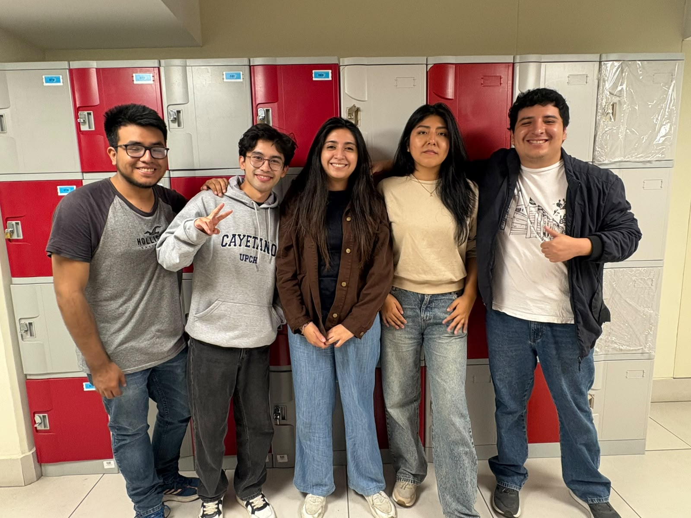

# Proyecto: PDBI - Grupo 10
> Proyecto desarrollado para la asignatura de Proyecto de Biodiseño I.

---

## 👥 Equipo de Trabajo

| Foto Grupal |
| :---: |
|  **Integrantes del Proyecto** |

 

| Integrante | Datos de Contacto y Rol |
| :--- | :--- |
| **HERRERA LEZCANO, NICOLAS VLADIMIR** | ✉️ `nicolas.herrera@upch.pe` 🛠️ *Rol: Diseñador de BD / Líder* |
| **CATACORA CARRILLO, MARÍA ALEJANDRA** | ✉️ `maria.catacora.c@upch.pe` 🛠️ *Rol: Desarrollador ETL* |
| **FERNANDEZ BERNAOLA, DAVIDT BRAYAMN** | ✉️ `davidt.fernandez@upch.pe` 🛠️ *Rol: Analista de Datos* |
| **RODRÍGUEZ SOLANO, MILAGROS MARIAJOSÉ** | ✉️ `milagros.rodriguez.s@upch.pe` 🛠️ *Rol: Desarrollador ETL* |
| **OLIVA GONZALES, HUDSON HUMBERTO** | ✉️ `hudson.oliva.g@upch.pe` 🛠️ *Rol: Analista de Datos* |

---

## Problemática a resolver: 
Carencia de dispositivos de tamizaje que muestren y señalen alteraciones en sonidos cardiopulmonares, lo que genera retardos y posibles errores en el diagnóstico de patologías

## Descripción del Proyecto
Estetoscopio electrónico portátil orientado a contextos rurales, capaz de realizar localmente la adquisición, preprocesamiento y clasificación TinyML de sonidos cardiopulmonares, proporcionando retroalimentación visual y auditiva, sin requerir conectividad externa.
